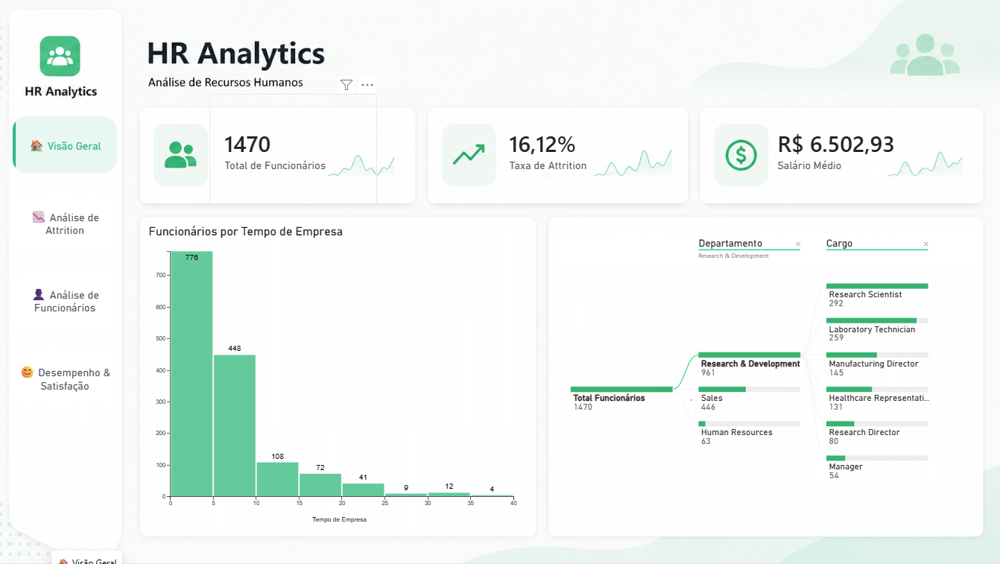
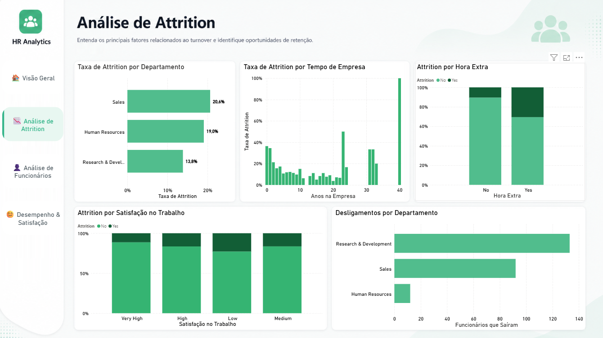
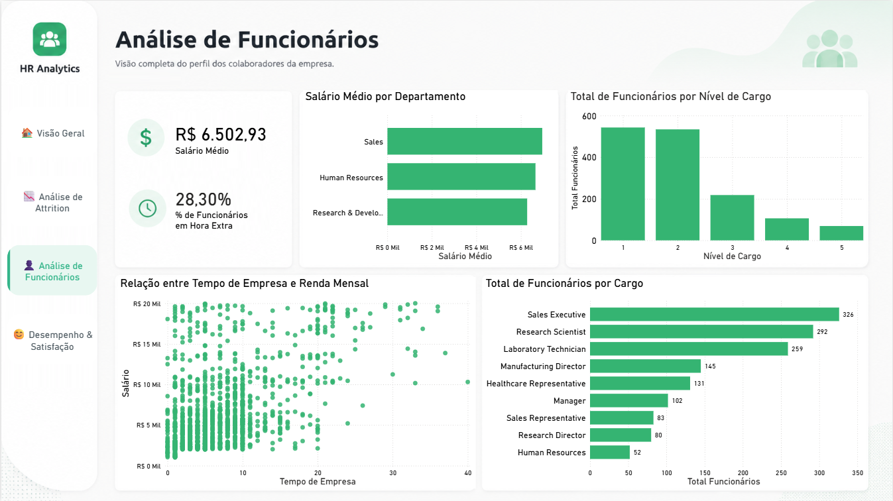
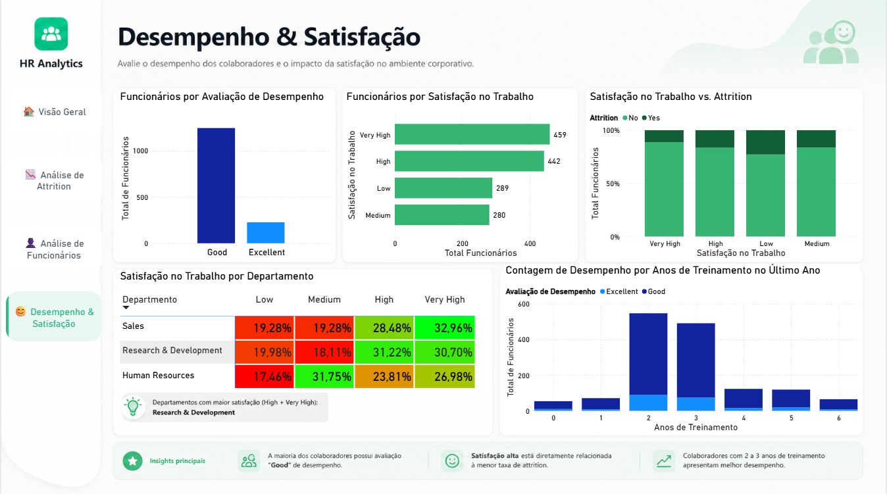

<div align="center">

# 📊 HR Analytics

### Análise de Recursos Humanos com Power BI

<br>

[](https://powerbi.microsoft.com/)
[](https://learn.microsoft.com/pt-br/dax/)
[](https://learn.microsoft.com/pt-br/power-query/)

</div>

---

## 📌 Sobre o projeto

O **HR Analytics** é um projeto desenvolvido no **Power BI** com o objetivo de analisar diferentes indicadores relacionados à área de Recursos Humanos.

O dashboard permite explorar informações sobre **funcionários, attrition, remuneração, departamentos, cargos, satisfação no trabalho, desempenho e treinamento**, proporcionando uma visão geral dos principais indicadores e permitindo uma análise mais detalhada dos fatores relacionados à saída de colaboradores.

O projeto foi desenvolvido com foco em **visualização de dados, criação de indicadores, análise de padrões e exploração de informações para apoio à tomada de decisões**.

---

## 🎯 Objetivo

O principal objetivo do projeto é transformar dados de Recursos Humanos em informações que possam ajudar a responder perguntas como:

- Quantos funcionários fazem parte da organização?
- Qual é a taxa de Attrition?
- Quais departamentos apresentam maior taxa de Attrition?
- Existe relação entre tempo de empresa e saída de funcionários?
- Como a satisfação no trabalho se relaciona com o Attrition?
- Qual o impacto das horas extras na saída de funcionários?
- Como os salários médios estão distribuídos entre os departamentos?
- Como os funcionários estão distribuídos entre os diferentes níveis e cargos?
- Existe relação entre tempo de empresa e renda mensal?
- Como estão distribuídos os níveis de desempenho?
- Existe relação entre treinamento e desempenho?

---

# 📊 Dashboard

O projeto é dividido em quatro páginas principais, cada uma com um objetivo específico de análise.

---

## 🏠 1. Visão Geral

A página de **Visão Geral** apresenta os principais indicadores do conjunto de dados e funciona como ponto inicial para exploração do dashboard.

### 📌 Principais indicadores

- 👥 Total de Funcionários
- 📉 Taxa de Attrition
- 💰 Salário Médio

Além dos indicadores, a página utiliza uma **Árvore de Decomposição** para permitir a exploração do total de funcionários por diferentes níveis, como:

**Departamento → Cargo**

Também é apresentada uma análise da distribuição de funcionários de acordo com o **tempo de empresa**.

### 🔎 Principais recursos

- Cards de indicadores
- Árvore de Decomposição
- Distribuição de funcionários por tempo de empresa
- Navegação entre páginas

---

## 📉 2. Análise de Attrition

A página de **Análise de Attrition** é dedicada à investigação dos desligamentos de funcionários e dos possíveis fatores associados.

### 📌 Análises realizadas

#### Taxa de Attrition por Departamento

Permite comparar a taxa de saída dos funcionários entre os diferentes departamentos.

#### Taxa de Attrition por Tempo de Empresa

Analisa como a taxa de Attrition varia de acordo com o tempo que o funcionário permanece na empresa.

#### Attrition por Satisfação no Trabalho

Permite observar a distribuição de Attrition considerando os diferentes níveis de satisfação dos funcionários.

#### Attrition por Hora Extra

Analisa a relação entre a realização de horas extras e o Attrition.

#### Desligamentos por Departamento

Apresenta a quantidade de funcionários que saíram da empresa em cada departamento.

### 💡 Objetivo da análise

Essa página busca facilitar a identificação de **padrões de desligamento** e possíveis fatores relacionados à rotatividade de funcionários.

---

## 👤 3. Análise de Funcionários

A página de **Análise de Funcionários** apresenta informações relacionadas ao perfil e à distribuição dos colaboradores.

### 📌 Análises realizadas

#### Salário Médio por Departamento

Compara o salário médio entre os diferentes departamentos.

#### Total de Funcionários por Nível de Cargo

Apresenta a distribuição dos funcionários de acordo com seus níveis hierárquicos.

#### Relação entre Tempo de Empresa e Renda Mensal

Utiliza um gráfico de dispersão para analisar a relação entre:

- Tempo de empresa
- Renda mensal
- Funcionários

Essa visualização permite observar possíveis padrões entre experiência dentro da empresa e remuneração.

#### Total de Funcionários por Cargo

Apresenta a quantidade de funcionários distribuída entre os diferentes cargos.

#### Percentual de Funcionários em Overtime

Indicador utilizado para acompanhar a proporção de funcionários que realizam horas extras.

---

## 😊 4. Desempenho & Satisfação

A última página combina indicadores relacionados ao **desempenho, satisfação e treinamento dos funcionários**.

### 📌 Análises realizadas

#### Funcionários por Avaliação de Desempenho

Apresenta a distribuição dos funcionários de acordo com suas avaliações de desempenho.

#### Funcionários por Satisfação no Trabalho

Permite visualizar a quantidade de funcionários em cada nível de satisfação.

#### Satisfação no Trabalho por Departamento

Tabela que permite comparar os níveis de satisfação entre os diferentes departamentos.

#### Satisfação no Trabalho vs. Attrition

Analisa a relação entre satisfação no trabalho e saída de funcionários.

#### Desempenho por Anos de Treinamento

Analisa a distribuição das avaliações de desempenho de acordo com a quantidade de treinamentos realizados no último ano.

---

# 📌 Principais KPIs

| KPI | Descrição |
|---|---|
| 👥 Total de Funcionários | Quantidade total de funcionários |
| 📉 Taxa de Attrition | Percentual de funcionários que deixaram a empresa |
| 💰 Salário Médio | Média salarial dos funcionários |
| 🚨 Funcionários que Saíram | Quantidade de funcionários desligados |
| ⏱️ % Funcionários Overtime | Percentual de funcionários que realizam horas extras |

---

# 🧮 Medidas e DAX

O projeto utiliza medidas para criação dos principais indicadores e análises do dashboard.

Entre os principais indicadores e medidas utilizados estão:

- `Total Funcionários`
- `Taxa de Attrition`
- `Salário Médio`
- `Funcionários que Saíram`
- `% Funcionários Overtime`
- `% Funcionários por Satisfação`

O uso de medidas permite que os indicadores sejam recalculados dinamicamente conforme os filtros e contextos de análise aplicados no relatório.

---

# 🛠️ Tecnologias utilizadas

<div align="center">


</div>

### Ferramentas e conceitos utilizados

- **Power BI**
- **DAX**
- **Power Query**
- **Modelagem de dados**
- **Medidas**
- **KPIs**
- **Visualização de dados**
- **Árvore de Decomposição**
- **Gráfico de dispersão**
- **Gráficos de barras e colunas**
- **Tabela/matriz**
- **Análise exploratória de dados**

---

# 🎨 Design e experiência

O dashboard foi desenvolvido com foco em uma experiência de navegação simples e intuitiva.

A interface utiliza uma identidade visual própria para o projeto, com:

- 🎨 Identidade visual relacionada à área de Recursos Humanos
- 🧭 Navegação entre páginas
- 📊 Cards para os principais indicadores
- 📈 Diferentes tipos de visualização de dados
- 🔎 Visualizações voltadas à exploração dos dados
- 📱 Organização das informações por áreas de análise

---

# 🖼️ Visualizações

## 🏠 Visão Geral



---

## 📉 Análise de Attrition



---

## 👤 Análise de Funcionários



---

## 😊 Desempenho & Satisfação



---

## 🚀 Principais aprendizados

Este projeto foi desenvolvido como parte do meu processo de aprendizado em Análise de Dados e Business Intelligence.

Durante o desenvolvimento, pude praticar conceitos como:

- Construção de dashboards
- Criação de KPIs
- Desenvolvimento de medidas em DAX
- Organização e apresentação de informações
- Análise de indicadores de Recursos Humanos
- Exploração de relações entre diferentes variáveis
- Escolha de visualizações adequadas para cada análise
- Construção de uma experiência de navegação dentro do Power BI

---

📚 Próximos passos

Pretendo continuar aprimorando meus conhecimentos em Power BI, DAX, SQL, Excel e Python, desenvolvendo novos projetos e explorando diferentes cenários de análise de dados.

<div align="center">
📊 Transformando dados em informações.
<br>

⭐ Obrigado por visitar este projeto!

</div> ```

# 📁 Estrutura do projeto

```text
HR-Analytics/
│
├── README.md
│
├── dashboard/
│   └── HR-Analytics.pbix
│
├── images/
│   ├── visao-geral.png
│   ├── attrition.png
│   ├── funcionarios.png
│   └── desempenho-satisfacao.png
│
├── backgrounds/
│   ├── Overview.png
│   ├── attrition.png
│   ├── Employee.png
│   └── performance&satisfaction.png
│
└── data/
    └── Human_Resources.csv
